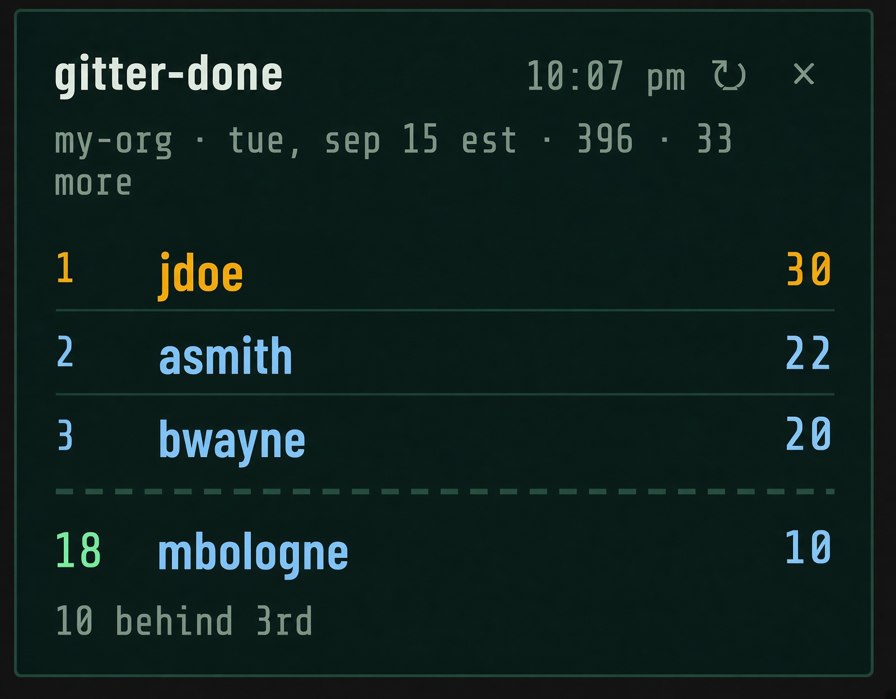

# gitter-done

Always-on-top desktop overlay that ranks **today’s git contributions** for your org.

Shows the top 3 and your place. Click the board to expand the full leaderboard.



## Requirements

- Node.js 18+
- [GitHub CLI](https://cli.github.com/) (`gh`) logged into the git host
- Access to the org you want to rank

## Setup

```bash
git clone https://github.com/adjit/gitter-done.git
cd gitter-done
npm install
cp .env.example .env
```

On Windows PowerShell, copy the env file with:

```powershell
Copy-Item .env.example .env
```

Edit `.env`:

```
GIT_ORG=github.com/my-org
```

`GIT_ORG` is `host/org`. Examples:

- `github.com/my-org`
- `github.com/your-org`

Log into that host (once per machine):

```bash
gh auth login --hostname git.bruin.com
```

Start the overlay:

```bash
npm start
```

Print today’s board in the terminal:

```bash
npm run board
```

## Using it

- Drag the title bar to move the overlay
- Click the subtitle or the list to open the full ranking; click again to collapse
- ↻ refreshes immediately
- × quits
- Rankings refresh every 3 minutes

## What it counts

Commits **authored today in America/New_York**, including:

- `main` / `develop` on every org repo pushed today
- other branches that moved today on the busiest repos
- commits on pull requests updated today

Bots (GitHub Actions, `*-bot`, Grafana) are excluded. People are ranked by commit count.

## Config

| Variable | Required | Default | Meaning |
| --- | --- | --- | --- |
| `GIT_ORG` | yes | — | `host/org`, e.g. `github.com/my-org` |
| `GH_TOKEN` | no | `gh auth token` for that host | API token |
| `GIT_TZ` | no | `America/New_York` | Day boundary for “today” |
| `POLL_MS` | no | `180000` | Refresh interval |

Do not commit `.env`.
